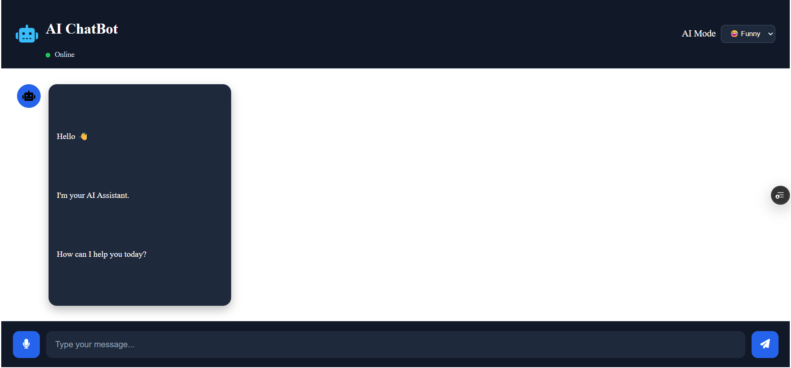
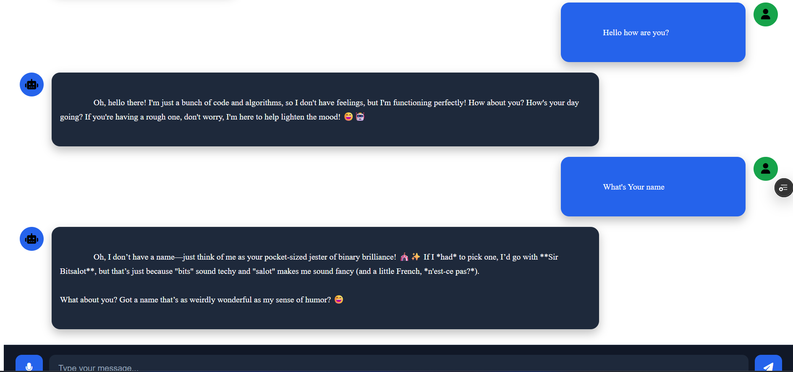

# 🤖 AI ChatBot using LangChain + Mistral AI

An intelligent AI-powered chatbot built using **LangChain**, **Mistral AI**, **FastAPI**, and a responsive **HTML/CSS/JavaScript** frontend.

The chatbot supports multiple AI personalities (Funny, Angry, and Sad) and provides real-time conversational responses through the Mistral Large Language Model.

---

## 🚀 Features

- 🤖 AI-powered conversational chatbot
- 🧠 LangChain integration
- ⚡ Mistral AI LLM
- 🎭 Multiple AI personalities
  - 😡 Angry Mode
  - 😂 Funny Mode
  - 😢 Sad Mode
- 🌐 FastAPI REST API backend
- 💻 Responsive HTML/CSS/JavaScript frontend
- 🔄 Real-time communication using Fetch API
- 🎨 Modern ChatGPT-inspired user interface
- ☁️ Backend deployed on Render
- 🚀 Frontend deployed on Vercel

---

## 🛠 Tech Stack

### Frontend
- HTML5
- CSS3
- JavaScript
- Font Awesome

### Backend
- Python
- FastAPI
- Uvicorn

### AI
- LangChain
- Mistral AI
- ChatMistralAI

### Deployment
- Render
- Vercel
- GitHub


### Live DEMO
https://ai-chat-bot-one-hazel.vercel.app
---

## 📂 Project Structure

```
AI-ChatBot/
│
├── backend/
│   ├── app.py
│   ├── chatbot.py
│   ├── requirements.txt
│   ├── .env
│   └── ...
│
├── frontend/
│   ├── index.html
│   ├── style.css
│   ├── script.js
│   └── favicon.ico
│
├── README.md
└── .gitignore
```

---

## ⚙️ Installation

### Clone Repository

```bash
git clone https://github.com/YourUsername/AI-ChatBot.git
```

```bash
cd AI-ChatBot
```

---

### Backend Setup

Create Virtual Environment

```bash
python -m venv .venv
```

Activate

Windows

```bash
.venv\Scripts\activate
```

Linux / Mac

```bash
source .venv/bin/activate
```

Install Dependencies

```bash
pip install -r requirements.txt
```

---

### Create .env File

```env
MISTRAL_API_KEY=your_api_key
```

---

### Run Backend

```bash
uvicorn app:app --reload
```

Backend runs at

```
http://127.0.0.1:8000
```

Swagger Documentation

```
http://127.0.0.1:8000/docs
```

---

### Run Frontend

```bash
cd frontend
python -m http.server 5500
```

Open

```
http://localhost:5500
```

---

## API Endpoint

### POST

```
/chat
```

Request

```json
{
  "message": "Hello",
  "mode": "funny"
}
```

Response

```json
{
  "response": "Hello! 😄"
}
```

---

## 📸 Screenshots

### Home


### Chat Interface



---

## Future Enhancements

- 🎤 Speech-to-Text
- 🔊 Text-to-Speech
- 🌍 Multi-language Support
- 🧠 Conversation Memory
- 📄 PDF Chat
- 📷 Image Understanding
- 📝 Markdown Rendering
- 💬 Streaming Responses
- 📂 Chat History
- 🌙 Light/Dark Theme
- 🔐 User Authentication
- 📊 Chat Analytics
- 🤖 Multiple LLM Support
  - OpenAI
  - Gemini
  - Claude
  - Groq
  - DeepSeek
- 📁 File Upload
- 📑 Document Q&A (RAG)
- 🖼 Image Generation
- 🎙 Voice Assistant Mode

---

## Learning Outcomes

Through this project, I learned:

- FastAPI REST API Development
- LangChain Basics
- Prompt Engineering
- Mistral AI Integration
- API Communication
- Frontend-Backend Integration
- Environment Variables
- Deployment using Render & Vercel
- Git & GitHub Workflow

---

## Author

**Rutik Kanzariya**

GitHub:
https://github.com/YourUsername

LinkedIn:
https://linkedin.com/in/YourProfile

---

## ⭐ Support

If you found this project helpful, please consider giving it a ⭐ on GitHub.